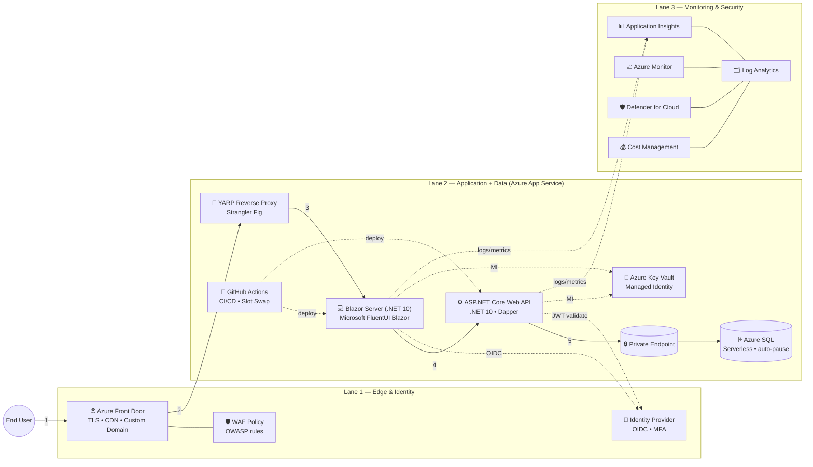
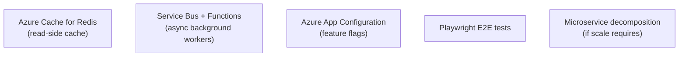
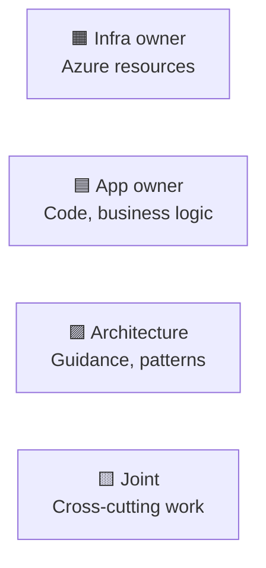

# 🏗️ Target Architecture (Mermaid)

> Code-as-source-of-truth version of the target architecture diagram.
> Keep this file in Git; renders automatically on GitHub.

---

## Runtime data flow

---

## Future ideas (out of scope)

---

## Ownership legend

---

_A reusable architecture diagram template, kept generic._
